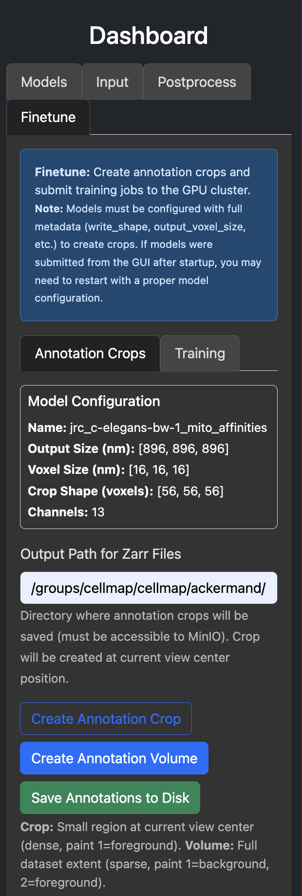
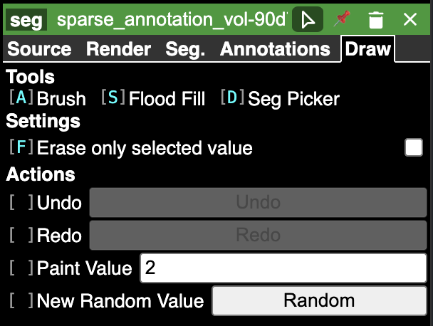
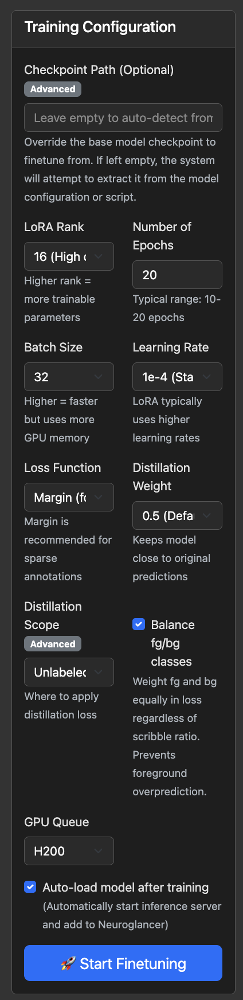

# Finetuning Guide

This guide walks through the full finetuning workflow in CellMap-Flow: loading data, creating annotations, and training a finetuned model — all from the dashboard.

## 1. Launch the Dashboard

Start by loading your data and model with a YAML configuration file:

```bash
cellmap_flow_yaml my_yamls/jrc_c-elegans-bw-1_affinities.yaml
```

This starts the dashboard with your dataset and model loaded into the Neuroglancer viewer.

## 2. Create an Annotation Volume


Navigate to the **Finetune** tab in the dashboard.

Under **Annotation Crops**, you will see your model configuration (name, output size, voxel size, crop shape, channels).

1. Set the **Output Path for Zarr Files** to a directory where annotation data will be saved. This must be accessible to the MinIO server that the dashboard starts.
2. Click **Create Annotation Volume**.
   - This creates a sparse annotation zarr covering the full dataset extent, where each chunk maps to one training sample.
   - A MinIO server will start automatically to serve the zarr for editing in Neuroglancer.


## 3. Set Up Annotation Tools in Neuroglancer


Once the annotation volume is created and added to the viewer:

1. **Select the annotation layer** by right-clicking on it in the layer list (it will be named something like `sparse_annotation_vol-XXXX`).
2. Go to the **Draw** tab for that layer.
3. **Bind keyboard shortcuts** to the drawing tools:
   - Click the small box next to each tool name (e.g. `[A] Brush`, `[S] Flood Fill`, `[D] Seg Picker`).
   - Press the letter you want to assign to that tool.
   - Once bound, activate a tool by pressing **Shift + the assigned letter**.


## 4. Annotate

When you start drawing, Neuroglancer will ask if you want to write to the file — click **Yes**.

### Annotation label rules

- **Paint Value 1** = **background** (this voxel is not the object of interest)
- **Paint Value 2** = **foreground** (this voxel is the object of interest)
- For **affinities models** with multiple object IDs, use higher paint values (3, 4, ...) for distinct object instances. The finetuning pipeline will automatically convert these instance IDs into affinity targets using the offsets defined in the model script.
- **Paint Value 0** = **unannotated / ignored** — these voxels are excluded from the loss during training.

You can change the paint value in the Draw tab by editing the **Paint Value** field, or click **Random** next to **New Random Value** to pick a new instance ID.

Annotate as many chunks as you like across the dataset. Only chunks with non-zero annotations will be used for training.

## 5. Training

Switch to the **Training** tab in the Finetune section.



### Training configuration options

| Parameter | Description |
|---|---|
| **Checkpoint Path** | (Optional, Advanced) Override the base model checkpoint to finetune from. Leave empty to auto-detect from the model configuration or script. |
| **LoRA Rank** | Controls the number of trainable parameters. Higher rank = more capacity but more memory. Typical values: 4 (low), 8 (default), 16 (high). |
| **Number of Epochs** | How many passes over the training data. Typical range: 10–20. |
| **Batch Size** | Number of samples per training step. Higher = faster but uses more GPU memory. |
| **Learning Rate** | Step size for optimization. 1e-4 is a good starting point for LoRA. |
| **Loss Function** | The training objective. **MSE** for standard regression. **Margin** is recommended for sparse annotations (auto-selected when sparse volumes are detected). |
| **Distillation Weight** | Keeps the finetuned model close to the original model's predictions. 0.5 is a good default. Set to 0.0 to disable. |
| **Distillation Scope** | (Advanced) Where to apply distillation loss — **Unlabeled** (only on unannotated voxels) or **All** (everywhere). |
| **Balance fg/bg classes** | Weights foreground and background equally in the loss regardless of how much of each you've annotated. Prevents the model from overpredicting whichever class has more annotations. |
| **GPU Queue** | Which GPU queue to submit the training job to (e.g. H100, H200). |
| **Auto-load model after training** | When checked, the finetuned model will automatically start an inference server and be added to the Neuroglancer viewer once training completes. |

### Start training

Click **Start Finetuning** to submit the training job to the GPU cluster. You can monitor training progress via the live log stream in the Training tab.

## 6. Iterative Refinement

After reviewing the finetuned model's predictions in Neuroglancer:

1. Add more annotations or correct existing ones in the annotation volume.
2. Go back to the **Training** tab.
3. Click **Restart Finetuning** — this retrains on the same GPU using your updated annotations without needing to resubmit a new job.
4. Updated parameters (epochs, learning rate, loss, etc.) can be changed before restarting.

Repeat this annotate-train-review cycle until the model performs well on your data.
