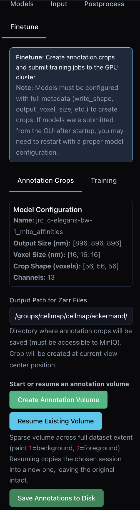
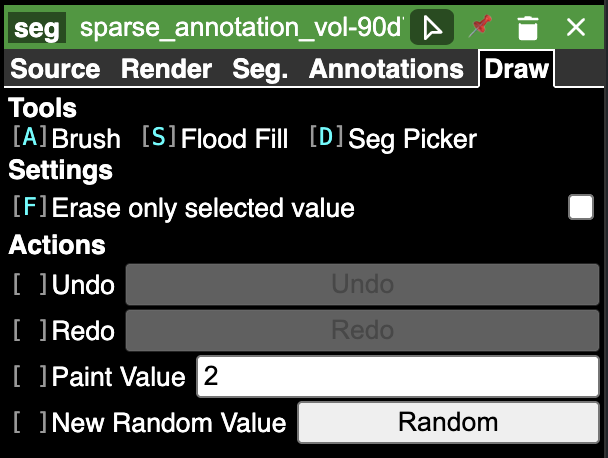
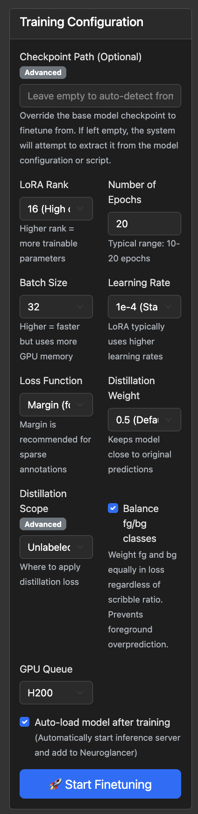

# Finetuning Guide

This guide walks through the full finetuning workflow in CellMap-Flow: loading data, creating annotations, and training a finetuned model — all from the dashboard.

## Installation

Finetuning needs an editable checkout, not the PyPI release — the dependency
set is not installable from PyPI alone (see the notes below). So start by
cloning the repository:

```bash
git clone https://github.com/janelia-cellmap/cellmap-flow.git
cd cellmap-flow
```

Everything after this assumes you are in that directory; the `.` in the
install commands below refers to the checkout.

### With pixi (recommended)

```bash
pixi install
```

That is the whole install. It reads `pixi.toml` and builds an environment
with every prerequisite pinned by `pixi.lock`. Run commands in it with
`pixi run <command>`, e.g. `pixi run cellmap_flow_view -d /path/to/data.zarr`
— no separate activation step.

The first run takes several minutes: the Neuroglancer fork is built from
source, which compiles a C++ extension and bundles the web client with npm.

### Without pixi

```bash
mamba create -n cellmap-flow-finetune python=3.11 minio-server minio-client -c conda-forge -y
mamba activate cellmap-flow-finetune
pip install git+https://github.com/briossant/neuroglancer@feature/voxel-annotation
pip install -e ".[finetune]"
```

### What these install, and why they are not just `pip install cellmap-flow`

- **MinIO** (server + client) — a local S3-compatible server that serves
  annotation zarr files to Neuroglancer for painting. Conda-forge only:
  upstream stopped publishing prebuilt community server binaries, so
  `dl.min.io` returns `410 Gone` and the GitHub releases carry no server
  assets. Conda-forge still builds it from source.
- **Neuroglancer** (voxel-annotation fork) — adds the voxel-level painting
  tools and the S3 write support they depend on. Upstream Neuroglancer has
  neither, and the fork is not published to PyPI. Note that it keeps
  upstream's version number, so a version check cannot tell them apart; if
  painting tools are missing from the Draw tab, you have the upstream build.
- **LoRA/PEFT dependencies** — for parameter-efficient finetuning.

The fork is declared in `pixi.toml` rather than in `pyproject.toml`'s
`[project.optional-dependencies]`, because a PEP 508 direct git reference
there would make the published PyPI package unuploadable.

## 1. Launch the Dashboard

Start by loading your data and model with a YAML configuration file:

```bash
cellmap_flow_yaml my_yamls/jrc_c-elegans-bw-1_affinities.yaml
```

This starts the dashboard with your dataset and model loaded into the Neuroglancer viewer.

## 2. Create or Resume an Annotation Volume


Navigate to the **Finetune** tab in the dashboard.

Under **Annotation Crops**, you will see your model configuration (name, output size, voxel size, crop shape, channels) along with controls for starting a new sparse annotation volume, resuming a previous session, and syncing annotations from MinIO back to disk.

### Start a new volume

1. Set the **Output Path for Zarr Files** to a directory where annotation data will be saved. This must be accessible to the MinIO server that the dashboard starts.
2. Click **New Volume**.
3. This creates a sparse annotation zarr covering the full dataset extent, where each chunk maps to one training sample.
4. A MinIO server will start automatically to serve the zarr for editing in Neuroglancer.

### Resume an existing volume

If you already have a prior annotation session:

1. Set **Output Path for Zarr Files** to the root directory where you want the resumed session to be created.
2. Click **Resume Existing Volume**.
3. In the modal, scan the directory containing existing timestamped finetuning sessions.
4. Select a session and click **Load Selected**.

This copies the chosen session into a new session directory, rather than editing the original in place. The copied session records its source in `loaded_from.json`.

### Save annotations to disk

While you are painting in Neuroglancer, edits are served through MinIO. Click **Save Annotations to Disk** to explicitly sync those in-progress annotations back to local storage.

Painted regions are also shown in the viewer as bounding boxes through the `annotated_regions` layer.


## 3. Set Up Annotation Tools in Neuroglancer


Once the annotation volume is created or resumed and added to the viewer:

1. **Select the annotation layer** by right-clicking on it in the layer list (it will be named something like `sparse_annotation_vol-XXXX`).
2. Go to the **Draw** tab for that layer.
3. **Bind keyboard shortcuts** to the drawing tools:
   - Click the small box next to each tool name (e.g. `[A] Brush`, `[S] Flood Fill`, `[D] Seg Picker`).
   - Press the letter you want to assign to that tool.
   - Once bound, activate a tool by pressing **Shift + the assigned letter**.


## 4. Annotate

When you start drawing, Neuroglancer will ask if you want to write to the file — click **Yes**.

### Annotation label rules

- **Paint Value 1** = **background** (this voxel is not the object of interest)
- **Paint Value 2** = **foreground** (this voxel is the object of interest)
- For **affinities models** with multiple object IDs, use higher paint values (3, 4, ...) for distinct object instances. The finetuning pipeline will automatically convert these instance IDs into affinity targets using the offsets defined in the model script.
- **Paint Value 0** = **unannotated / ignored** — these voxels are excluded from the loss during training.

You can change the paint value in the Draw tab by editing the **Paint Value** field, or click **Random** next to **New Random Value** to pick a new instance ID.

Annotate as many chunks as you like across the dataset. Only chunks with non-zero annotations will be used for training.

### Deprecated dense crop workflow

The **Create Annotation Crop** button is still available under the advanced section, but it is deprecated. It creates a small dense crop at the current view center and is rarely needed compared with the sparse full-volume workflow above.

## 5. Training

Switch to the **Training** tab in the Finetune section.



### Training configuration options

| Parameter | Description |
|---|---|
| **Checkpoint Path** | (Optional, Advanced) Override the base model checkpoint to finetune from. Leave empty to auto-detect from the model configuration or script. |
| **LoRA Rank** | Controls the number of trainable parameters. The current UI exposes `4`, `8`, `16`, and `64`. Higher rank = more capacity and more memory use. |
| **Number of Epochs** | How many passes over the training data. The UI currently defaults to `20`. |
| **Batch Size** | Number of samples per training step. The UI currently exposes `1`, `2`, `4`, `8`, `16`, and `32`. Higher = faster but uses more GPU memory. |
| **Learning Rate** | Step size for optimization. The UI currently exposes values from `1e-7` through `1e-1`, with `1e-4` as the standard default. |
| **Loss Function** | The training objective. The current UI exposes **Margin**, **MSE**, **BCE**, **Dice**, and **Combined (Dice + BCE)**. **Margin** is the default and is generally the best fit for sparse scribble-style annotations. |
| **Margin** | Only used when **Loss Function** is set to **Margin**. Controls how strict the margin loss is; smaller values provide more learning signal, while larger values create a wider no-gradient band. |
| **Distillation Weight** | Keeps the finetuned model close to the original model's predictions. The UI currently exposes `0`, `0.01`, `0.05`, `0.1`, `0.2`, `0.5`, `1.0`, `2.0`, `5.0`, and `10.0`, with `0.1` as the current default. Set to `0` to disable distillation. |
| **Distillation Scope** | (Advanced) Where to apply distillation loss — **Unlabeled** (only on unannotated voxels) or **All** (everywhere). |
| **Label Smoothing** | Softens hard `0/1` targets. Useful when annotations are noisy; set to `0` if you want sharp targets. |
| **Balance fg/bg classes** | Weights foreground and background equally in the loss regardless of how much of each you've annotated. Prevents the model from overpredicting whichever class dominates the scribbles. |
| **GPU Queue** | Which GPU queue to submit the training job to (e.g. H100, H200). |
| **Auto-load model after training** | When checked, the finetuned model will automatically start an inference server and be added to the Neuroglancer viewer once training completes. |

### Start training

Click **Start Finetuning** to submit the training job to the GPU cluster. You can monitor training progress via the live log stream in the Training tab.

## 6. Iterative Refinement

After reviewing the finetuned model's predictions in Neuroglancer:

1. Add more annotations or correct existing ones in the annotation volume.
2. Go back to the **Training** tab.
3. Click **Restart Finetuning** — this retrains on the same GPU using your updated annotations without needing to resubmit a new job.
4. Updated parameters (epochs, learning rate, loss, etc.) can be changed before restarting.

Repeat this annotate-train-review cycle until the model performs well on your data.
