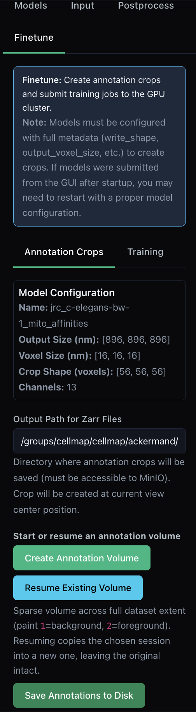
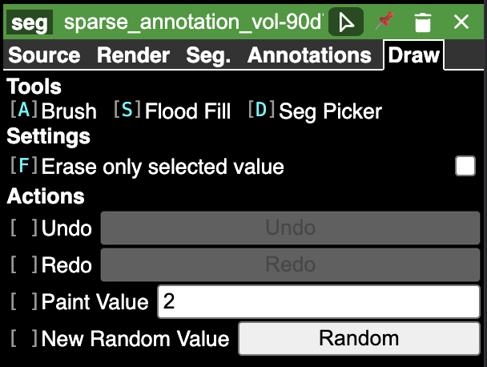
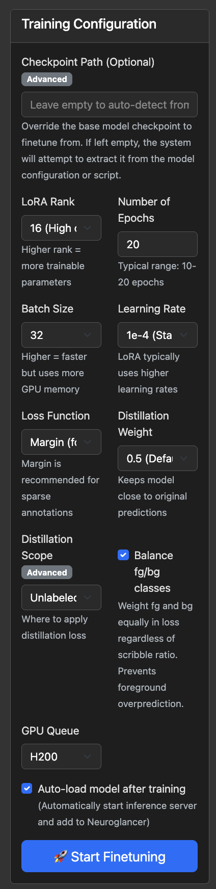

# Finetuning Guide

This guide walks through the full finetuning workflow in CellMap-Flow: loading data, creating annotations, and training a finetuned model — all from the dashboard.

## Installation

Finetuning needs an editable checkout, not the PyPI release — the dependency
set is not installable from PyPI alone (see the notes below). So start by
cloning the repository:

```bash
git clone https://github.com/janelia-cellmap/cellmap-flow.git
cd cellmap-flow
```

Everything after this assumes you are in that directory; the `.` in the
install command below refers to the checkout.

```bash
mamba create -n cellmap-flow-finetune python=3.11 minio-server minio-client -c conda-forge -y
mamba activate cellmap-flow-finetune
pip install git+https://github.com/briossant/neuroglancer@feature/voxel-annotation
pip install -e ".[finetune]"
```

### What these install, and why they are not just `pip install cellmap-flow`

- **MinIO** (server + client) — a local S3-compatible server that serves
  annotation zarr files to Neuroglancer for painting. Conda-forge only:
  upstream stopped publishing prebuilt community server binaries, so
  `dl.min.io` returns `410 Gone` and the GitHub releases carry no server
  assets. Conda-forge still builds it from source.
- **Neuroglancer** (voxel-annotation fork) — adds the voxel-level painting
  tools and the S3 write support they depend on. Upstream Neuroglancer has
  neither, and the fork is not published to PyPI. Note that it keeps
  upstream's version number, so a version check cannot tell them apart; if
  painting tools are missing from the Draw tab, you have the upstream build.
- **LoRA/PEFT dependencies** — for parameter-efficient finetuning.

The fork has to be installed as a separate step rather than being listed in
`pyproject.toml`'s `[project.optional-dependencies]`, because a PEP 508 direct
git reference there would make the published PyPI package unuploadable.

## 1. Launch the Dashboard

Start by loading your data and model with a YAML configuration file:

```bash
cellmap_flow yaml my_yamls/jrc_c-elegans-bw-1_affinities.yaml
```

This starts the dashboard with your dataset and model loaded into the Neuroglancer viewer.

## 2. Create or Resume an Annotation Volume


Navigate to the **Finetune** tab in the dashboard.

Under **Annotation Crops**, you will see your model configuration (name, output size, voxel size, crop shape, channels) along with controls for starting a new sparse annotation volume, resuming a previous session, and syncing annotations from MinIO back to disk.

### Start a new volume

1. Set the **Output Path for Zarr Files** to a directory where annotation data will be saved. This must be accessible to the MinIO server that the dashboard starts.
2. Click **New Volume**.
3. This creates a sparse annotation zarr covering the full dataset extent, where each chunk maps to one training sample. Its labels are uint8 (ids up to 255), or uint16 (up to 65,535) for an instance model (affinities, Cellpose), whose seeds can hold hundreds of objects. A volume made before keeps its type: make a new one if a seed says its objects do not fit.
4. A MinIO server will start automatically to serve the zarr for editing in Neuroglancer.

### Resume an existing volume

If you already have a prior annotation session:

1. Set **Output Path for Zarr Files** to the root directory where you want the resumed session to be created.
2. Click **Resume Existing Volume**.
3. In the modal, scan the directory containing existing timestamped finetuning sessions.
4. Select a session and click **Load Selected**.

This copies the chosen session into a new session directory, rather than editing the original in place. The copied session records its source in `loaded_from.json`.

### Save annotations to disk

While you are painting in Neuroglancer, edits are served through MinIO. Click **Save Annotations to Disk** to explicitly sync those in-progress annotations back to local storage.

Painted regions are also shown in the viewer as bounding boxes through the `annotated_regions` layer.


## 3. Set Up Annotation Tools in Neuroglancer


Once the annotation volume is created or resumed and added to the viewer:

1. The new layer, named `annotation_vol-XXXX`, is **selected with its panel open**, ready to paint. (To come back to it later, right-click it in the layer list.)
2. Go to its **Draw** tab. **A** is bound to the brush and **F** to flood fill; press **Shift + the letter** to use one.
3. To bind another tool (e.g. `[D] Seg Picker`), click the small box next to its name and press the letter you want.


## 4. Annotate

When you start drawing, Neuroglancer will ask if you want to write to the file — click **Yes**.

### Annotation label rules

- **Paint Value 1** = **background** (this voxel is not the object of interest)
- **Paint Value 2** = **foreground** (this voxel is the object of interest)
- For **affinities models** with multiple object IDs, use higher paint values (3, 4, ...) for distinct object instances. The finetuning pipeline will automatically convert these instance IDs into affinity targets using the offsets defined in the model script.
- For **Cellpose models**, paint each cell (or mitochondrion, nucleus...) with its own value (2, 3, 4, ...), whole within the XY slice you paint it in, and background with 1. The pipeline turns them into the flows Cellpose predicts (see [Cellpose models](#cellpose-models)).
- **Paint Value 0** = **unannotated / ignored** — these voxels are excluded from the loss during training.

You can change the paint value in the Draw tab by editing the **Paint Value** field, or click **Random** next to **New Random Value** to pick a new instance ID.

Annotate as many chunks as you like across the dataset. Only chunks with non-zero annotations will be used for training.

### Label the patch on screen in one click

The **Patch on screen** panel acts on a box centred where the viewer looks: one model output patch, unless *Box (voxels)* under *Seed, split and box settings* says otherwise. Every button fills or changes only that box, keeps what you painted, and re-reads the paint layer afterwards.

- **Seed from Prediction** copies the prediction of the model picked in *Prediction from* (default: the volume model's latest finetune, else that model) into the unpainted voxels: an id per object (2 and up), background 1. Then fix it with the brush; that is much quicker than painting objects from nothing. An object you already painted part of keeps your id.
- **All Background** labels every unpainted voxel 1, for a region of false positives.
- **Split Objects** gives each connected object an id of its own. To split a merge, paint a background wall through it in every slice it spans (in one slice with *Per z slice*). A stroke joining two objects merges them.
- **Undo** takes back the last of these (up to 10), except voxels painted since.

How a seed makes objects of the prediction is its **Method**, under *Seed, split and box settings*. Only the methods that fit the chosen model's output are listed, picked from what the model outputs, not from its name. The best fit comes first, and a method you pick is kept whenever the model offers it:

| Method | Offered for | What it does |
|---|---|---|
| **Model's instances** | a server that serves integer labels (Cellpose with `output: masks`) | The model's own ids, one object each, numbered afresh. An id repeated in another server chunk is another object, since Cellpose numbers each chunk from 1. |
| **Mutex watershed** | affinity models (offsets in the script, or `_aff` channels) | Reads the offset channels. Neighbours join where the affinity is over the threshold and stay apart where it is under, so touching objects split. A fragment whose mean affinity is under the threshold is background. |
| **Distance watershed** | distance models (`distance` in the name) | Foreground is over the threshold. Objects grow from the distance's peaks (h-maxima 0.05 deep), so touching objects split where the distance dips between them. |
| **Threshold + components** | every model | Foreground is over the threshold, and each connected object gets an id. Touching objects stay one. This is the default when a request names no method. |

The other settings:

- **Box (voxels)** is the box every button covers: z, y, x annotation voxels, or one number for all three. Blank means one model output patch, whose size the field shows. Any size works, in z too, because the model still reads its whole input around the box; the box only picks which of its prediction to copy. A smaller box is less to check and fix (Cellpose's 8 × 512 × 512 patch can hold hundreds of objects), and the unpainted voxels around it are left out of training. *Mark as Good* still marks one whole patch.
- **Threshold** is a probability whatever the model's activation: 0.5 is the model's own boundary (0.5 on [0, 1] output, 0 on tanh or unbounded output such as logits or signed distances). Higher keeps only confident voxels. The mutex watershed uses it as its bias. Model's instances ignores it.
- **Min object** turns objects of fewer voxels into background.
- **Connectivity** (used by Seed and by Split Objects) sets which neighbours touch. *faces* (6 neighbours, the default) means a one-voxel background wall cuts an object. *+ edges* (18) and *all* (26) join voxels that touch along an edge or at a corner.
- **Per z slice** (used by threshold + components and by Split Objects) labels each z slice on its own in 2D, which suits objects annotated or segmented slice by slice.

On a uint16/uint32 volume for an instance target (affinities, Cellpose's flows), new ids count up past the patch's largest. Otherwise they reuse ids the patch does not hold, so a uint8 volume never runs out. The settings are kept in the browser. A patch over 128³ voxels is asked about first. Routes: `POST /api/finetune/view-labels/{seed,background,split,undo}` and `GET /api/finetune/view-labels/sources`, which lists the models and the methods each offers. The segmenters are in `cellmap_flow.post.segment`, which `LabelPostprocessor` (with the same `connectivity`, `min_size` and `per_slice` options) and `AffinityPostprocessor` also use.

### Ask an AI model to paint a plane

The **AI annotate** panel sends one 2D plane around the point under the mouse (**Shift+G**) to a hosted image model, which paints the structure you pick; you review it, then accept it into the volume or reject it, and **Undo** takes it back. It is off until you turn it on, and the plane leaves the cluster: see [AI-assisted annotation](ai_annotate.md) for setup and what is sent where.

## 5. Training

Switch to the **Training** tab in the Finetune section.



### Training configuration options

| Parameter | Description |
|---|---|
| **Checkpoint Path** | (Optional, Advanced) Override the base model checkpoint to finetune from. Leave empty to auto-detect from the model configuration or script. |
| **LoRA Rank** | Controls the number of trainable parameters. The UI exposes `4`, `8`, `16`, `64` and `0`. Higher rank = more capacity and more memory use; `0` is a full finetune (every parameter, no adapter). Only the ranks the selected model can take are offered (see [Which models can be finetuned](#which-models-can-be-finetuned)). |
| **Number of Epochs** | How many passes over the training data. The UI currently defaults to `20`. |
| **Batch Size** | Number of samples per training step. The UI currently exposes `1`, `2`, `4`, `8`, `16`, and `32`. Higher = faster but uses more GPU memory. |
| **Learning Rate** | Step size for optimization. The UI currently exposes values from `1e-7` through `1e-1`, with `1e-4` as the standard default. |
| **Loss Function** | The training objective. The current UI exposes **Margin**, **MSE**, **BCE**, **Dice**, and **Combined (Dice + BCE)**. **Margin** is the default and is generally the best fit for sparse scribble-style annotations. |
| **Margin** | Only used when **Loss Function** is set to **Margin**. Controls how strict the margin loss is; smaller values provide more learning signal, while larger values create a wider no-gradient band. A distance model on scribbles uses neither (see [below](#distance-models-on-scribbles)). |
| **Distillation Weight** | Keeps the finetuned model close to the original model's predictions. The UI currently exposes `0`, `0.01`, `0.05`, `0.1`, `0.2`, `0.5`, `1.0`, `2.0`, `5.0`, and `10.0`, with `0.1` as the current default. Set to `0` to disable distillation. |
| **Distillation Scope** | (Advanced) Where to apply distillation loss — **Unlabeled** (only on unannotated voxels) or **All** (everywhere). |
| **Label Smoothing** | Softens hard `0/1` targets. Useful when annotations are noisy; set to `0` if you want sharp targets. |
| **Balance fg/bg classes** | Weights foreground and background equally in the loss regardless of how much of each you've annotated. Prevents the model from overpredicting whichever class dominates the scribbles. |
| **GPU Queue** | Which GPU queue to submit the training job to (e.g. H100, H200). |
| **Auto-load model after training** | When checked, the finetuned model will automatically start an inference server and be added to the Neuroglancer viewer once training completes. |

### Which models can be finetuned

What a model can be finetuned with follows from its network, not its name, and the LoRA Rank list offers only that:

| The model's network is... | LoRA and full | Full only (rank 0) | Not finetunable |
|---|---|---|---|
| Plain PyTorch: cellmap and Hugging Face exports, fly checkpoints, DaCapo runs, scripts, BioImage Model Zoo models with PyTorch weights, Cellpose | yes | | |
| Compiled (TorchScript): zoo models whose only weights are TorchScript | | yes: LoRA attaches adapters beside a network's layers, which a compiled network does not allow | |
| ONNX or TensorFlow: zoo models with only those weights | | | yes: they cannot be trained |

A **BioImage Model Zoo** model is trained as it serves: its own normalization, slice by slice for a 2D model, its halo cut off and its sigmoid applied, so the finetuned model reads the data exactly as the original did. The loss is picked from its outputs as for any other model. Descriptions it cannot follow (label outputs, binarize, StarDist) are refused with the reason. The ilastik *Enhancer* models expect a pixel classifier's probabilities, not raw EM: they can be finetuned, but on raw EM their starting point means little.

### Cellpose models

A Cellpose model (Cellpose-SAM) predicts, for every pixel, a flow pointing to its cell's centre and a cell probability, so it trains on those: the dashboard picks the **flow** loss for it. Each painted instance's flows are computed the way Cellpose computes them, slice by slice; unpainted voxels are left out of the loss, and so are the flows of instances cut by the training patch's edge (their centre is unknown). Cellpose's own training (`train_seg`) has no such mask: on sparse painting it would learn "no cell" wherever nothing was painted, which is why finetuning goes through cellmap-flow's trainer.

- Training sees XY slices only, as Cellpose segments them: paint each instance whole in the slice you paint it in.
- It trains on 256 x 256 tiles, the only size Cellpose-SAM's network takes, one slice at a time.
- LoRA (the default) or a full finetune. At batch size 1 both fit an L4 (24 GB): LoRA trains in 5.6 GB at 0.25 s a step, a full finetune in 8 GB at 0.36 s, and the live server's chunks peak at 9 and 13 GB with training alongside. An H100 runs either at 0.06 s a step; larger batches want one.
- The finetuned model is served as Cellpose is, with its masks or probabilities.
- Cellpose's models are trained on data licensed CC-BY-NC (non-commercial), and so are their finetunes.

### Distance models on scribbles

A distance model (one whose name contains `distance`, such as the cellmap `*_distance_*` models) predicts each voxel's signed distance to the object boundary, `sigmoid(2d/σ)`. Scribbles do not say where that boundary is, so on a session with painted strokes it trains on the interval loss instead of the loss picked in the form:

- Each painted voxel gets bounds on its distance, in nm: at most the distance to the nearest voxel painted as the other class, and at least the distance to the nearest voxel not painted as its own class (unpainted voxels and the patch's edge count as "maybe the other class"). Where the paint is dense the two meet, and the distance is exact.
- The loss is zero between the bounds, grows linearly outside them, and is five times steeper on the wrong side of the boundary; a voxel of slack forgives strokes that stray over an edge (after iSDF, Ortiz et al., RSS 2022).
- The predicted field may not get steeper than a distance field (`--slope-weight`, default 1). Without this, bounds alone let the field collapse into a step.
- Unpainted voxels get no bounds: distillation, at least 0.5, and the random anchor patches hold them.

The bounds are computed on each training patch, so near its edges they are looser than the paint would allow. Fully labelled crops (imported, with no strokes) still train on the exact distance with BCE.

### Start training

Click **Start Finetuning** to submit the training job to the GPU cluster. You can monitor training progress via the live log stream in the Training tab.

## 6. Iterative Refinement

After reviewing the finetuned model's predictions in Neuroglancer:

1. Add more annotations or correct existing ones in the annotation volume.
2. Go back to the **Training** tab.
3. Click **Restart Finetuning** — this retrains on the same GPU using your updated annotations without needing to resubmit a new job.
4. Updated parameters (epochs, learning rate, loss, etc.) can be changed before restarting.

Repeat this annotate-train-review cycle until the model performs well on your data.
